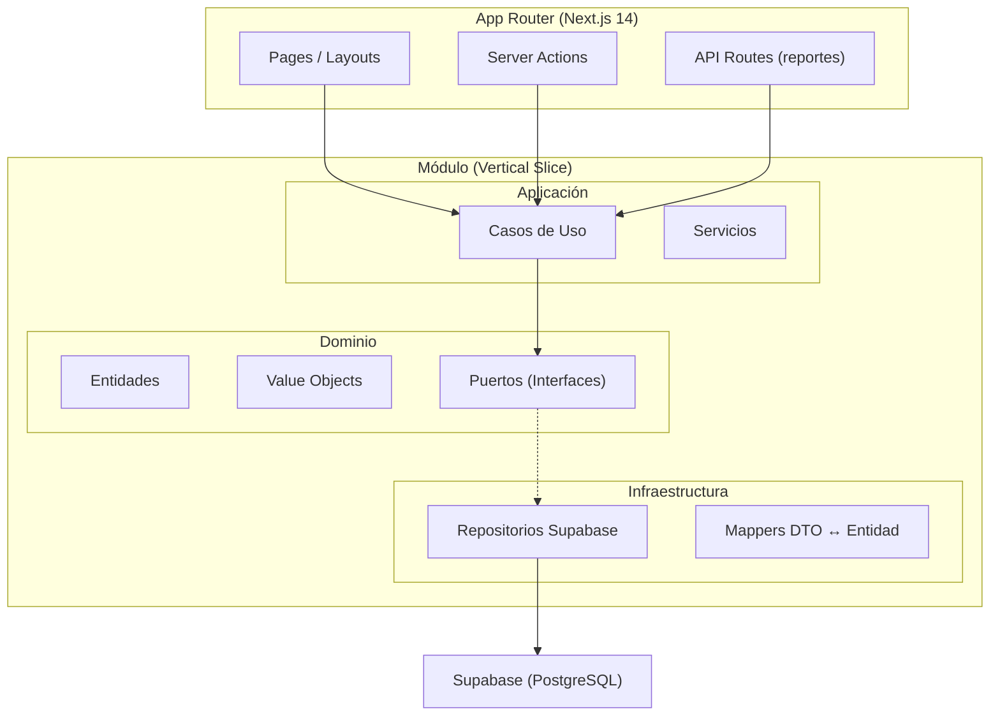
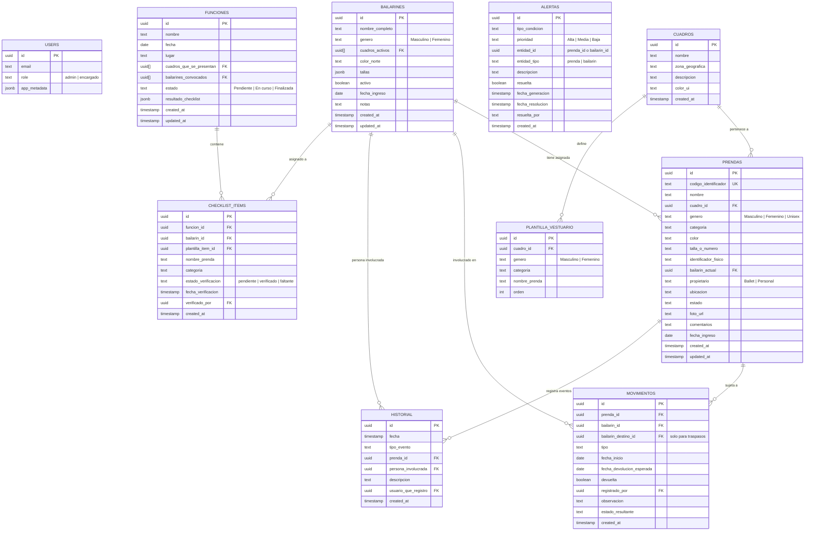
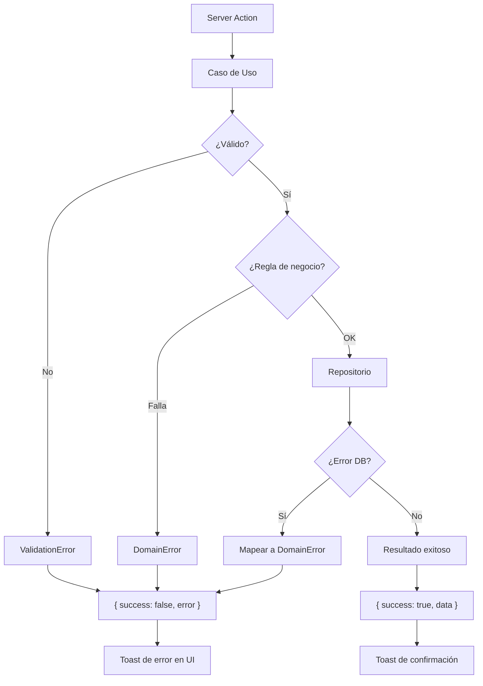

# Design Document: BFV Wardrobe Management

## Overview

Plataforma web de gestión integral de vestuario para el Ballet Folklórico de Valdivia (BFV). El sistema se construye con Next.js 14 App Router, TypeScript, Supabase (PostgreSQL + Auth + Storage), Tailwind CSS y shadcn/ui, siguiendo arquitectura hexagonal con vertical slicing.

La plataforma permite:

- Gestionar un inventario de prendas con códigos auto-generados y fotos
- Administrar perfiles de bailarines con tallas y cuadros activos
- Registrar asignaciones, préstamos, devoluciones y traspasos
- Configurar plantillas de vestuario por cuadro/género y calcular completitud
- Mantener historial inmutable de eventos
- Generar alertas automáticas por condiciones de atención
- Crear checklists de verificación para funciones
- Exportar reportes a PDF y Excel

El sistema soporta dos roles (admin y encargado) con RLS en Supabase, es responsivo (mínimo 320px), y se despliega en Vercel.

## Architecture

### Patrón General: Hexagonal + Vertical Slicing

Cada módulo funcional es un "slice" vertical independiente con tres capas:



### Estructura de Carpetas

```
src/
├── app/                          # Next.js App Router
│   ├── (auth)/                   # Grupo de rutas autenticadas
│   │   ├── inventario/
│   │   ├── bailarines/
│   │   ├── movimientos/
│   │   ├── cuadros/
│   │   ├── alertas/
│   │   ├── funciones/
│   │   ├── reportes/
│   │   └── layout.tsx            # Layout con sidebar
│   ├── login/
│   └── layout.tsx                # Root layout
├── modules/
│   ├── inventario/
│   │   ├── domain/
│   │   │   ├── entities/         # Prenda, CodigoIdentificador
│   │   │   ├── value-objects/    # EstadoPrenda, Categoria, Genero
│   │   │   └── ports/           # PrendaRepository (interface)
│   │   ├── application/
│   │   │   ├── use-cases/       # CrearPrenda, BuscarPrendas, etc.
│   │   │   └── services/        # CodigoGeneratorService
│   │   └── infrastructure/
│   │       ├── repositories/    # SupabasePrendaRepository
│   │       ├── mappers/         # PrendaMapper
│   │       └── actions/         # Server Actions
│   ├── bailarines/
│   │   ├── domain/
│   │   ├── application/
│   │   └── infrastructure/
│   ├── movimientos/
│   │   ├── domain/
│   │   ├── application/
│   │   └── infrastructure/
│   ├── cuadros/
│   │   ├── domain/
│   │   ├── application/
│   │   └── infrastructure/
│   ├── historial/
│   │   ├── domain/
│   │   ├── application/
│   │   └── infrastructure/
│   ├── alertas/
│   │   ├── domain/
│   │   ├── application/
│   │   └── infrastructure/
│   ├── funciones/
│   │   ├── domain/
│   │   ├── application/
│   │   └── infrastructure/
│   └── reportes/
│       ├── domain/
│       ├── application/
│       └── infrastructure/
├── shared/
│   ├── components/              # Componentes UI reutilizables (shadcn/ui)
│   ├── hooks/                   # Custom hooks compartidos
│   ├── lib/                     # Supabase client, utilidades
│   ├── types/                   # Tipos compartidos
│   └── constants/               # Constantes globales
└── supabase/
    ├── migrations/              # Migraciones SQL
    └── seed.sql                 # Datos iniciales
```

### Decisiones Arquitectónicas

| Decisión       | Elección                      | Justificación                                                 |
| -------------- | ----------------------------- | ------------------------------------------------------------- |
| Renderizado    | Server Components por defecto | Reduce JS en cliente, mejor SEO, acceso directo a datos       |
| Mutaciones     | Server Actions                | Colocación con UI, tipado end-to-end, progressive enhancement |
| Estado cliente | React state + URL params      | Filtros en URL para compartibilidad, estado local para UI     |
| Validación     | Zod                           | Esquemas compartidos entre cliente y servidor                 |
| PDF            | @react-pdf/renderer           | Componentes React para PDFs, renderizado server-side          |
| Excel          | xlsx (SheetJS)                | Librería madura, sin dependencias nativas                     |
| Imágenes       | Supabase Storage              | Integrado con auth, CDN incluido                              |
| Roles          | JWT app_metadata              | Sin query extra, evaluado en RLS directamente                 |

## Components and Interfaces

### Puertos del Dominio (Interfaces)

```typescript
// modules/inventario/domain/ports/prenda-repository.port.ts
interface PrendaRepository {
  findById(id: string): Promise<Prenda | null>;
  findAll(
    filters: PrendaFilters,
    pagination: Pagination,
  ): Promise<PaginatedResult<Prenda>>;
  search(query: string, filters: PrendaFilters): Promise<Prenda[]>;
  create(prenda: CreatePrendaDTO): Promise<Prenda>;
  update(id: string, data: UpdatePrendaDTO): Promise<Prenda>;
  delete(id: string): Promise<void>;
  getNextSequentialNumber(genero: Genero, cuadro: Cuadro): Promise<number>;
}

// modules/bailarines/domain/ports/bailarin-repository.port.ts
interface BailarinRepository {
  findById(id: string): Promise<Bailarin | null>;
  findAll(
    filters: BailarinFilters,
    pagination: Pagination,
  ): Promise<PaginatedResult<Bailarin>>;
  findByCuadro(cuadroId: string): Promise<Bailarin[]>;
  create(bailarin: CreateBailarinDTO): Promise<Bailarin>;
  update(id: string, data: UpdateBailarinDTO): Promise<Bailarin>;
  setActivo(id: string, activo: boolean): Promise<void>;
}

// modules/movimientos/domain/ports/movimiento-repository.port.ts
interface MovimientoRepository {
  findById(id: string): Promise<Movimiento | null>;
  findActivos(filters: MovimientoFilters): Promise<Movimiento[]>;
  findByPrenda(prendaId: string): Promise<Movimiento[]>;
  findByBailarin(bailarinId: string): Promise<Movimiento[]>;
  create(movimiento: CreateMovimientoDTO): Promise<Movimiento>;
  marcarDevuelto(id: string): Promise<void>;
}

// modules/historial/domain/ports/historial-repository.port.ts
interface HistorialRepository {
  findByPrenda(
    prendaId: string,
    pagination: CursorPagination,
  ): Promise<HistorialEntry[]>;
  findByBailarin(
    bailarinId: string,
    pagination: CursorPagination,
  ): Promise<HistorialEntry[]>;
  create(entry: CreateHistorialDTO): Promise<HistorialEntry>;
}

// modules/cuadros/domain/ports/cuadro-repository.port.ts
interface CuadroRepository {
  findAll(): Promise<Cuadro[]>;
  findById(id: string): Promise<Cuadro | null>;
  create(cuadro: CreateCuadroDTO): Promise<Cuadro>;
  update(id: string, data: UpdateCuadroDTO): Promise<Cuadro>;
  delete(id: string): Promise<void>;
}

// modules/cuadros/domain/ports/plantilla-repository.port.ts
interface PlantillaRepository {
  findByCuadroYGenero(
    cuadroId: string,
    genero: Genero,
  ): Promise<PlantillaItem[]>;
  setByCuadroYGenero(
    cuadroId: string,
    genero: Genero,
    items: PlantillaItem[],
  ): Promise<void>;
}

// modules/alertas/domain/ports/alerta-repository.port.ts
interface AlertaRepository {
  findActivas(): Promise<Alerta[]>;
  findResueltas(pagination: Pagination): Promise<PaginatedResult<Alerta>>;
  create(alerta: CreateAlertaDTO): Promise<Alerta>;
  resolver(id: string, usuario: string): Promise<void>;
  resolverAutomatica(id: string): Promise<void>;
  deleteByEntidad(entidadId: string, tipo: TipoAlerta): Promise<void>;
}

// modules/funciones/domain/ports/funcion-repository.port.ts
interface FuncionRepository {
  findById(id: string): Promise<Funcion | null>;
  findAll(pagination: Pagination): Promise<PaginatedResult<Funcion>>;
  create(funcion: CreateFuncionDTO): Promise<Funcion>;
  updateEstado(id: string, estado: EstadoFuncion): Promise<void>;
}

// modules/funciones/domain/ports/checklist-repository.port.ts
interface ChecklistRepository {
  findByFuncion(funcionId: string): Promise<ChecklistItem[]>;
  verificarItem(itemId: string, usuario: string): Promise<void>;
  marcarFaltante(itemId: string, usuario: string): Promise<void>;
  generarChecklist(
    funcionId: string,
    items: CreateChecklistItemDTO[],
  ): Promise<void>;
}
```

### Componentes UI Principales

```typescript
// Componentes de layout
Sidebar; // Navegación lateral, colapsable en mobile
PageHeader; // Título de página + acciones
DataTable<T>; // Tabla genérica con paginación, ordenamiento, filtros

// Componentes de inventario
PrendaCard; // Tarjeta individual de prenda con historial
PrendaForm; // Formulario crear/editar prenda
ImageUploader; // Upload de foto con preview y validación

// Componentes de bailarines
BailarinProfile; // Perfil completo con vestuario por cuadro
BailarinForm; // Formulario crear/editar bailarín
CompletitudBar; // Barra de progreso de completitud

// Componentes de movimientos
AsignacionDialog; // Modal de asignación rápida (1 clic)
DevolucionDialog; // Modal de devolución
TraspasoDialog; // Modal de traspaso entre bailarines
MovimientosList; // Lista de movimientos activos

// Componentes de cuadros
PlantillaEditor; // Editor de plantilla de vestuario
CompletitudMatrix; // Tabla cruzada bailarines × prendas requeridas
CuadroBadge; // Badge con color del cuadro

// Componentes de funciones
ChecklistView; // Vista de checklist con marcado rápido
FuncionForm; // Formulario crear función
ProgressIndicator; // "X de Y verificados" con barra

// Componentes compartidos
AlertBadge; // Indicador de prioridad de alerta
ColorNorteBadge; // Etiqueta visual de color norte
Toast; // Notificaciones (shadcn/ui toast)
SkeletonLoader; // Loading states
```

## Data Models

### Diagrama Entidad-Relación



### Entidades del Dominio

```typescript
// modules/inventario/domain/entities/prenda.entity.ts
interface Prenda {
  id: string;
  codigoIdentificador: string; // "{G}{C}-{NNN}"
  nombre: string; // max 100
  cuadroId: string;
  genero: Genero;
  categoria: Categoria;
  color: string | null; // max 50
  tallaONumero: string | null; // max 20
  identificadorFisico: string | null; // max 50
  bailarinActualId: string | null;
  propietario: Propietario;
  ubicacion: string | null; // max 100
  estado: EstadoPrenda;
  fotoUrl: string | null;
  comentarios: string | null; // max 500
  fechaIngreso: Date;
  createdAt: Date;
  updatedAt: Date;
}

// modules/bailarines/domain/entities/bailarin.entity.ts
interface Bailarin {
  id: string;
  nombreCompleto: string; // max 100
  genero: GeneroBailarin;
  cuadrosActivos: string[]; // 1-3 cuadro IDs
  colorNorte: string | null;
  tallas: Tallas;
  activo: boolean;
  fechaIngreso: Date;
  notas: string | null; // max 500
  createdAt: Date;
  updatedAt: Date;
}

interface Tallas {
  camisa: string | null;
  pantalon: string | null;
  sombrero: string | null;
  calzado: string | null;
  personalizados: TallaPersonalizada[]; // max 5
}

interface TallaPersonalizada {
  nombre: string; // max 30
  valor: string; // max 30
}

// modules/movimientos/domain/entities/movimiento.entity.ts
interface Movimiento {
  id: string;
  prendaId: string;
  bailarinId: string;
  bailarinDestinoId: string | null; // solo traspasos
  tipo: TipoMovimiento;
  fechaInicio: Date;
  fechaDevolucionEsperada: Date | null;
  devuelta: boolean;
  registradoPor: string;
  observacion: string | null; // max 500
  estadoResultante: EstadoPrenda;
  createdAt: Date;
}
```

### Value Objects

```typescript
// Enumeraciones
type Genero = "Masculino" | "Femenino" | "Unisex";
type GeneroBailarin = "Masculino" | "Femenino";
type Categoria =
  | "Tocado"
  | "Ropa superior"
  | "Ropa inferior"
  | "Calzado"
  | "Accesorio"
  | "Joyería";
type EstadoPrenda =
  | "Disponible"
  | "En uso"
  | "En reparación"
  | "Faltante"
  | "Prestada"
  | "Dada de baja";
type TipoMovimiento =
  | "Asignación"
  | "Préstamo interno"
  | "Préstamo externo"
  | "Devolución"
  | "Traspaso";
type Propietario = "Ballet" | "Personal";
type Prioridad = "Alta" | "Media" | "Baja";
type EstadoFuncion = "Pendiente" | "En curso" | "Finalizada";
type TipoEvento =
  | "Asignación"
  | "Devolución"
  | "Cambio de estado"
  | "Reparación"
  | "Préstamo"
  | "Traspaso"
  | "Comentario agregado"
  | "Creación de prenda";
type EstadoVerificacion = "pendiente" | "verificado" | "faltante";
type Role = "admin" | "encargado";

// Value Object: Código Identificador
interface CodigoIdentificador {
  genero: "M" | "F" | "U";
  cuadro: "H" | "N" | "R";
  secuencial: number; // 1-999
  toString(): string; // "MH-001"
}
```

### Esquemas de Validación (Zod)

```typescript
// shared/lib/validations/prenda.schema.ts
const createPrendaSchema = z.object({
  nombre: z.string().min(1).max(100),
  cuadroId: z.string().uuid(),
  genero: z.enum(["Masculino", "Femenino", "Unisex"]),
  categoria: z.enum([
    "Tocado",
    "Ropa superior",
    "Ropa inferior",
    "Calzado",
    "Accesorio",
    "Joyería",
  ]),
  color: z.string().max(50).nullable().optional(),
  tallaONumero: z.string().max(20).nullable().optional(),
  identificadorFisico: z.string().max(50).nullable().optional(),
  propietario: z.enum(["Ballet", "Personal"]),
  ubicacion: z.string().max(100).nullable().optional(),
  estado: z.enum([
    "Disponible",
    "En uso",
    "En reparación",
    "Faltante",
    "Prestada",
    "Dada de baja",
  ]),
  comentarios: z.string().max(500).nullable().optional(),
  fechaIngreso: z.coerce.date(),
});

// shared/lib/validations/bailarin.schema.ts
const createBailarinSchema = z.object({
  nombreCompleto: z.string().min(1).max(100),
  genero: z.enum(["Masculino", "Femenino"]),
  cuadrosActivos: z.array(z.string().uuid()).min(1).max(3),
  colorNorte: z.string().nullable().optional(),
  tallas: z.object({
    camisa: z.string().nullable().optional(),
    pantalon: z.string().nullable().optional(),
    sombrero: z.string().nullable().optional(),
    calzado: z.string().nullable().optional(),
    personalizados: z
      .array(
        z.object({
          nombre: z.string().max(30),
          valor: z.string().max(30),
        }),
      )
      .max(5)
      .optional(),
  }),
  fechaIngreso: z.coerce.date(),
  notas: z.string().max(500).nullable().optional(),
});

// shared/lib/validations/movimiento.schema.ts
const createMovimientoSchema = z.object({
  prendaId: z.string().uuid(),
  bailarinId: z.string().uuid(),
  bailarinDestinoId: z.string().uuid().nullable().optional(),
  tipo: z.enum([
    "Asignación",
    "Préstamo interno",
    "Préstamo externo",
    "Devolución",
    "Traspaso",
  ]),
  fechaDevolucionEsperada: z.coerce.date().nullable().optional(),
  observacion: z.string().max(500).nullable().optional(),
});
```

### Row Level Security (RLS)

```sql
-- Estrategia: rol almacenado en auth.users.raw_app_meta_data->>'role'
-- Función helper para obtener rol
CREATE OR REPLACE FUNCTION public.get_user_role()
RETURNS text AS $$
  SELECT coalesce(
    auth.jwt()->'app_metadata'->>'role',
    'encargado'
  );
$$ LANGUAGE sql SECURITY DEFINER STABLE;

-- Ejemplo: tabla prendas
ALTER TABLE prendas ENABLE ROW LEVEL SECURITY;

-- Lectura: ambos roles
CREATE POLICY "Lectura prendas" ON prendas
  FOR SELECT USING (auth.uid() IS NOT NULL);

-- Escritura: solo admin
CREATE POLICY "Escritura prendas" ON prendas
  FOR INSERT WITH CHECK (get_user_role() = 'admin');

CREATE POLICY "Actualización prendas" ON prendas
  FOR UPDATE USING (get_user_role() = 'admin');

CREATE POLICY "Eliminación prendas" ON prendas
  FOR DELETE USING (get_user_role() = 'admin');

-- Excepción: movimientos y checklist_items permiten escritura a encargado
CREATE POLICY "Escritura movimientos" ON movimientos
  FOR INSERT WITH CHECK (auth.uid() IS NOT NULL);

CREATE POLICY "Escritura checklist" ON checklist_items
  FOR UPDATE USING (auth.uid() IS NOT NULL);
```

## Correctness Properties

_A property is a characteristic or behavior that should hold true across all valid executions of a system—essentially, a formal statement about what the system should do. Properties serve as the bridge between human-readable specifications and machine-verifiable correctness guarantees._

### Property 1: Código identificador format correctness

_For any_ valid combination of género (Masculino/Femenino/Unisex) and cuadro (Huaso/Norte/Rapa Nui), the generated código identificador SHALL match the regex pattern `^[MFU][HNR]-\d{3}$` where the first character maps correctly to the género, the second to the cuadro, and the numeric portion is between 001 and 999.

**Validates: Requirements 1.1**

### Property 2: Search returns only matching results

_For any_ inventory of prendas and any search query of 2 or more characters, every result returned by the search function SHALL contain the query string (case-insensitive) in at least one of: nombre, código identificador, or nombre del bailarín asignado.

**Validates: Requirements 1.6**

### Property 3: Prenda validation rejects invalid inputs

_For any_ prenda creation input where at least one required field (nombre, cuadro, género, categoría, estado) is empty or invalid, the validation SHALL reject the input and return error messages identifying all invalid fields.

**Validates: Requirements 1.7**

### Property 4: Image upload validation

_For any_ file metadata with a MIME type and size, the image validation function SHALL accept the file if and only if the type is one of (image/jpeg, image/png, image/webp) AND the size is ≤ 5 MB.

**Validates: Requirements 1.8, 1.9**

### Property 5: Completitud calculation correctness

_For any_ bailarín activo, cuadro, and plantilla de vestuario, the completitud percentage SHALL equal `floor((count of assigned prendas matching plantilla items) / (total plantilla items)) * 100`, and if the plantilla has zero items, the result SHALL be the special value "Sin plantilla definida".

**Validates: Requirements 2.2, 4.6, 4.7**

### Property 6: Bailarín filter correctness

_For any_ list of bailarines and any combination of filters (cuadro, género, estado activo/inactivo), every bailarín in the filtered result SHALL match ALL active filter criteria simultaneously.

**Validates: Requirements 2.3**

### Property 7: Bailarín validation rejects invalid inputs

_For any_ bailarín creation input where nombre_completo is empty, género is missing, cuadros_activos has 0 or more than 3 entries, or fecha_ingreso is missing, the validation SHALL reject the input and return appropriate error messages.

**Validates: Requirements 2.5, 2.8**

### Property 8: Inactive dancers excluded from completitud

_For any_ bailarín marked as inactivo, they SHALL NOT appear in default listings and SHALL NOT be included in completitud calculations for any cuadro, while their historical data remains intact.

**Validates: Requirements 2.7**

### Property 9: Movement state transitions

_For any_ prenda with estado "Disponible" and any valid bailarín, creating a movement of type "Asignación" SHALL set the prenda estado to "En uso" and bailarin_actual to the bailarín, while creating a movement of type "Préstamo interno" or "Préstamo externo" SHALL set the prenda estado to "Prestada" and bailarin_actual to the bailarín.

**Validates: Requirements 3.2**

### Property 10: Non-available prenda rejection

_For any_ prenda whose estado is NOT "Disponible", any attempt to create an assignment or loan movement SHALL be rejected with an error indicating the prenda is unavailable.

**Validates: Requirements 3.3**

### Property 11: Devolution resets prenda state

_For any_ active movement (devuelta = false) of type Asignación, Préstamo interno, or Préstamo externo, registering a devolution SHALL set the movement's devuelta to true, the prenda's estado to "Disponible", and the prenda's bailarin_actual to null.

**Validates: Requirements 3.4**

### Property 12: Overdue loan detection

_For any_ active loan (Préstamo interno or externo) with a fecha_devolucion_esperada, the loan SHALL be marked as "Vencido" if and only if the current date is strictly after the fecha_devolucion_esperada.

**Validates: Requirements 3.5**

### Property 13: Traspaso preserves estado and updates bailarín

_For any_ traspaso between two bailarines on a prenda, the prenda's bailarin_actual SHALL be updated to the destination bailarín AND the prenda's estado SHALL remain unchanged from before the traspaso.

**Validates: Requirements 3.7**

### Property 14: Double devolution rejection

_For any_ movement that is already marked as devuelta = true, any attempt to register another devolution SHALL be rejected with an error indicating the movement was already returned.

**Validates: Requirements 3.8**

### Property 15: History entry creation for completed actions

_For any_ successfully completed action of type (Asignación, Devolución, Cambio de estado, Reparación, Préstamo, Traspaso, Comentario agregado, Creación de prenda), the system SHALL create exactly one historial entry with the correct tipo_evento, prenda_id, persona_involucrada, and usuario_que_registró.

**Validates: Requirements 5.1, 5.4**

### Property 16: History immutability

_For any_ existing historial entry, no update or delete operation SHALL succeed, preserving the entry's original data indefinitely.

**Validates: Requirements 5.5**

### Property 17: No history for failed actions

_For any_ action that fails or is reverted, the system SHALL NOT create a corresponding historial entry, ensuring only successfully completed events are recorded.

**Validates: Requirements 5.6**

### Property 18: Alert generation with correct priority

_For any_ prenda or bailarín state, the alert system SHALL generate alerts for exactly the conditions that are met (Faltante sin movimiento posterior, En reparación >30 días, préstamo vencido, completitud <80%, sin ubicación, "Revisar" en comentarios), and each alert SHALL have the correct priority: Alta for préstamos vencidos and prendas faltantes, Media for reparaciones prolongadas and completitud baja, Baja for sin ubicación and comentarios de revisión.

**Validates: Requirements 6.1, 6.2**

### Property 19: Alert ordering

_For any_ set of active alerts, the display order SHALL be sorted by priority descending (Alta > Media > Baja) and within the same priority by fecha_generacion descending (most recent first).

**Validates: Requirements 6.3**

### Property 20: Alert auto-resolution

_For any_ active alert, if the condition that generated it no longer holds after a state change (e.g., faltante prenda is assigned, prenda receives ubicación, completitud rises above 80%), the alert SHALL be automatically resolved with "Resuelta por sistema" as the resolver.

**Validates: Requirements 6.6**

### Property 21: Checklist generation completeness

_For any_ función with a set of cuadros and convoked bailarines, the generated checklist SHALL contain exactly one item for each combination of (bailarín convocado, plantilla item for that bailarín's género and cuadro), with no duplicates and no missing combinations.

**Validates: Requirements 7.2**

### Property 22: Checklist statistics correctness

_For any_ checklist state, the progress SHALL correctly report: total = count of all items, verificados = count of items with estado "verificado", faltantes = count of items with estado "faltante", and porcentaje = floor(verificados / total \* 100).

**Validates: Requirements 7.4, 7.6**

### Property 23: Shopping list contains exactly "Faltante" items

_For any_ inventory state, the shopping list report SHALL contain exactly all prendas with estado "Faltante" and no prendas with any other estado, grouped by cuadro.

**Validates: Requirements 8.2**

### Property 24: Role-based access control

_For any_ authenticated user and any operation, access SHALL be granted if and only if: (a) the user has role "admin", OR (b) the user has role "encargado" AND the operation is either a read on any table, or a write on movimientos or checklist_items tables.

**Validates: Requirements 9.3, 9.4, 9.7**

### Property 25: Seed idempotency

_For any_ initial database state (empty or containing previous seed data), executing the seed operation SHALL produce the same final state with no duplicate records and no errors.

**Validates: Requirements 11.6**

## Error Handling

### Estrategia General

| Capa            | Manejo de Errores                                      |
| --------------- | ------------------------------------------------------ |
| Dominio         | Excepciones tipadas (DomainError subclasses)           |
| Aplicación      | Try/catch en casos de uso, retorno de Result<T, Error> |
| Infraestructura | Mapeo de errores Supabase → errores de dominio         |
| UI              | Toast de error con mensaje descriptivo                 |

### Tipos de Error

```typescript
// shared/types/errors.ts
abstract class DomainError extends Error {
  abstract readonly code: string;
}

class ValidationError extends DomainError {
  code = "VALIDATION_ERROR";
  constructor(public fields: Record<string, string>) {
    super("Validation failed");
  }
}

class NotFoundError extends DomainError {
  code = "NOT_FOUND";
  constructor(entity: string, id: string) {
    super(`${entity} ${id} not found`);
  }
}

class ConflictError extends DomainError {
  code = "CONFLICT";
  constructor(message: string) {
    super(message);
  }
}

class UnauthorizedError extends DomainError {
  code = "UNAUTHORIZED";
}

class ForbiddenError extends DomainError {
  code = "FORBIDDEN";
  constructor(operation: string) {
    super(`Insufficient permissions for: ${operation}`);
  }
}

class SequenceLimitError extends DomainError {
  code = "SEQUENCE_LIMIT";
  constructor(genero: string, cuadro: string) {
    super(`Código limit reached for ${genero}-${cuadro}`);
  }
}

class ImageUploadError extends DomainError {
  code = "IMAGE_UPLOAD_ERROR";
  constructor(reason: "format" | "size") {
    super(`Image rejected: ${reason}`);
  }
}

class MovementError extends DomainError {
  code = "MOVEMENT_ERROR";
  constructor(message: string) {
    super(message);
  }
}
```

### Flujo de Errores



### Manejo Transaccional

Para operaciones que involucran múltiples tablas (ej: asignación = movimiento + actualizar prenda + historial):

```typescript
// Usar Supabase RPC para transacciones
const { data, error } = await supabase.rpc("asignar_prenda", {
  p_prenda_id: prendaId,
  p_bailarin_id: bailarinId,
  p_tipo: tipo,
  p_usuario_id: usuarioId,
});
```

Las funciones PostgreSQL garantizan atomicidad: si falla cualquier paso, se revierte todo (incluyendo el historial, cumpliendo Req 5.6).

## Testing Strategy

### Enfoque Dual: Unit Tests + Property-Based Tests

| Tipo                 | Herramienta             | Propósito                                          |
| -------------------- | ----------------------- | -------------------------------------------------- |
| Property-Based Tests | fast-check + Vitest     | Verificar propiedades universales (25 properties)  |
| Unit Tests           | Vitest                  | Ejemplos específicos, edge cases, error conditions |
| Integration Tests    | Vitest + Supabase local | Verificar RLS, triggers, funciones SQL             |
| E2E Tests            | Playwright              | Flujos críticos de usuario                         |

### Property-Based Testing

- **Librería**: [fast-check](https://github.com/dubzzz/fast-check) con Vitest
- **Configuración**: Mínimo 100 iteraciones por propiedad
- **Tag format**: `Feature: bfv-wardrobe-management, Property {N}: {title}`
- Cada propiedad del diseño se implementa como UN test property-based
- Los generadores (arbitraries) cubren edge cases automáticamente (strings vacíos, arrays vacíos, valores límite)

### Estructura de Tests

```
tests/
├── properties/              # Property-based tests
│   ├── inventario.property.test.ts
│   ├── bailarines.property.test.ts
│   ├── movimientos.property.test.ts
│   ├── cuadros.property.test.ts
│   ├── historial.property.test.ts
│   ├── alertas.property.test.ts
│   ├── funciones.property.test.ts
│   ├── reportes.property.test.ts
│   └── auth.property.test.ts
├── unit/                    # Unit tests por módulo
│   ├── inventario/
│   ├── bailarines/
│   ├── movimientos/
│   └── ...
├── integration/             # Tests con Supabase local
│   ├── rls.test.ts
│   ├── triggers.test.ts
│   └── seed.test.ts
└── e2e/                     # Playwright E2E
    ├── inventario.spec.ts
    ├── asignacion.spec.ts
    └── checklist.spec.ts
```

### Unit Tests (Ejemplos y Edge Cases)

- Renderizado de componentes UI (tarjeta de prenda, perfil de bailarín)
- Comportamiento de toast (5s auto-dismiss, error persiste)
- Skeleton loaders durante carga
- Navegación sidebar colapsable
- Color badges por cuadro (ámbar, azul, rosa)
- Paginación con datasets específicos

### Integration Tests

- RLS policies: verificar que encargado no puede eliminar
- Triggers de historial en PostgreSQL
- Supabase Storage upload/download
- Seed idempotency contra base de datos real
- Funciones RPC transaccionales

### E2E Tests (Flujos Críticos)

1. Login → Inventario → Crear prenda → Verificar código generado
2. Perfil bailarín → Asignar prenda → Verificar completitud actualizada
3. Crear función → Generar checklist → Verificar ítems → Finalizar
4. Panel alertas → Resolver alerta → Verificar historial
